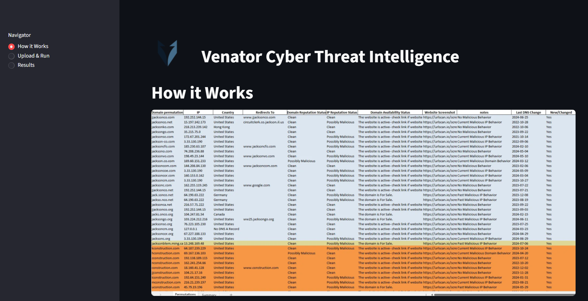
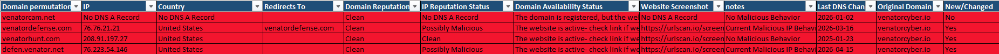
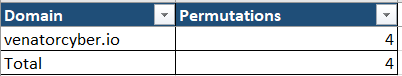
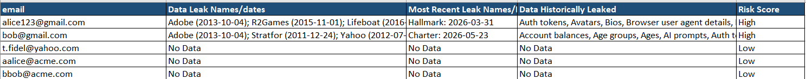
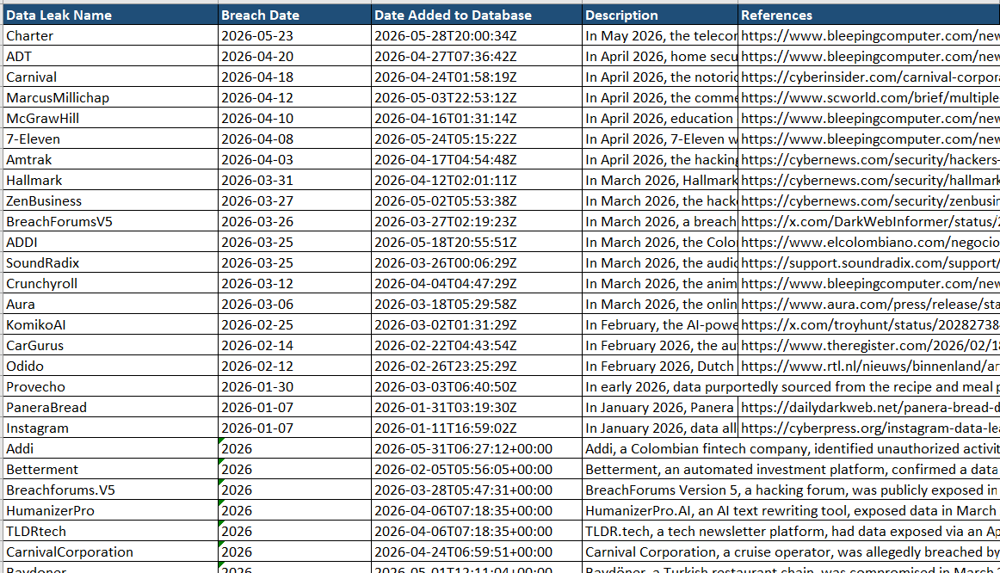
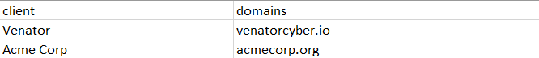
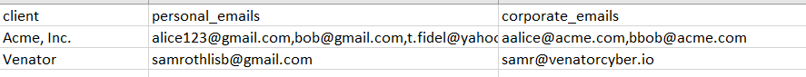
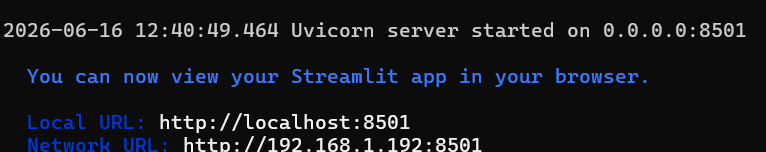
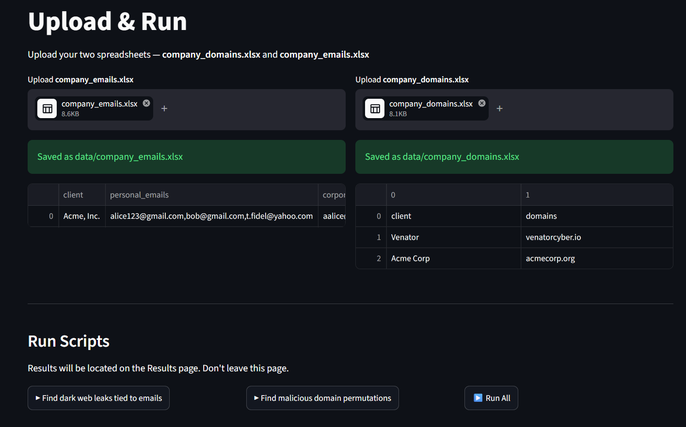
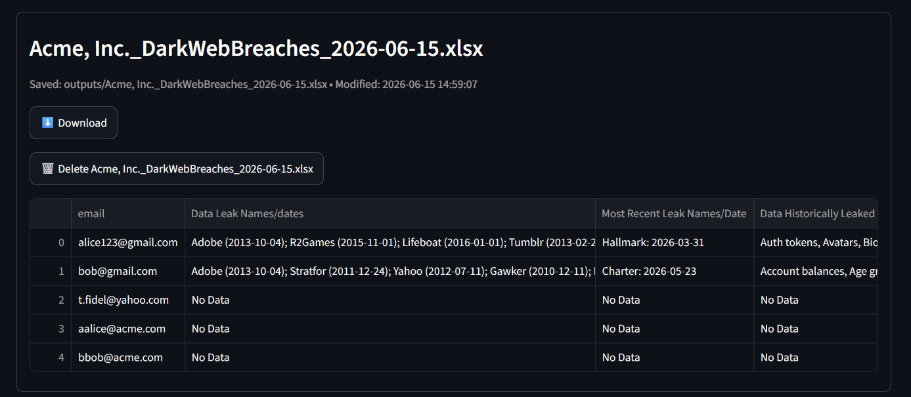

# VenatorCTI

A collection of Cyber Threat Intelligence (CTI) automation scripts designed to identify domain impersonation threats, monitor exposed credentials, and generate analyst-ready reports. Easy to use GUI-based application for running these scripts and uploading/downloading inputs and outputs. This should be set up on an INTERNAL ubuntu server or ubuntu virtual machine with a bridged IP.


---

## Features

### Domain Permutation Monitoring

Identifies lookalike domains that may be used for phishing, brand impersonation, credential harvesting, or fraud. 

#### Capabilities

- Generates domain permutations using DNSTwister- Filters results to `.com`, `.net`, and `.org`
- Resolves DNS A records for those domains that have MX records (i.e. are capable of receiving mail back from victims)
- Identifies hosting country for IP attached to A record
- Performs VirusTotal reputation checks on domain permutations
- Performs VirusTotal reputation checks on IP addresses attached to A records
- Retrieves domain registration status for domain (parked, for sale, active, etc.)
- Retrieves WHOIS update dates which shows how active domain management is
- Generates URLScan.io screenshots for domain websites if available
- Tracks new or changed domains between executions- Allows capability to filter out domains that havent changed or have been investigated already
- Produces a pretty Excel-based analyst reports ready for client delivery

#### Output

**Permutations Sheet**



**Summary Sheet**



---

### Dark Web Exposure Monitoring

Identifies exposed email addresses and breach activity across multiple breach intelligence sources.

#### Data Sources

- Have I Been Pwned (HIBP) - Paid, completely optional but does update more frequently for data leaks (its only $5 a month)
- XposedOrNot - Free

#### Capabilities

- Processes personal and corporate email addresses to identify exposed accounts (PII, passwords, other records, etc.)
- Tracks breach dates for each email-applicable breach
- Identifies most recent exposure for fast identification if run on a tempo
- Generates risk scores based on the information leaked and how recent
- Produces a pretty Excel-based analyst reports ready for client delivery

#### Risk Scoring

| Condition | Risk Score |
|------------|------------|
| Breach within previous 12 months | High |
| Password exposure identified | Medium |
| Historical exposure only | Low |

#### Output

**Leaked Data Sheet**



**Breach Details Sheet**




---

## Input Files

### Domain Monitoring



### Dark Web Monitoring




---

## Installation

### Clone Repository

```bash
git clone https://github.com/venator-ir/venatorcti.git
cd venatorcti
```

### Create Virtual Environment

```bash
python3 -m venv venv
source venv/bin/activate
```

### Install Requirements

```bash
pip install -r requirements.txt
```


## Acquiring API keys for Environment Variables

URLSCAN.io: https://urlscan.io/user/signup

Virus Total: https://www.virustotal.com/gui/join-us

RapidAPI: https://rapidapi.com/auth/sign-up

Have I Been Pwned (HIBP): https://haveibeenpwned.com/Subscription#corePlans

The Core plan for HIBP is not required, but is recommended for up to date breach information. 


Edit `.env` file in base of project folder:

```env
VT_API_KEY=YOUR_VIRUSTOTAL_API_KEY
HIBP_API_KEY=YOUR_HIBP_API_KEY # just leave default value there if no API key for HIBP
RAPIDAPI_KEY=YOUR_RAPIDAPI_KEY
URLSCAN_API_KEY=YOUR_URLSCAN_API_KEY
```
### Run the program

```bash
streamlit run app.py
```

### Access on http://<private IP>:8501



Note: If you cant access the GUI, make sure ufw isnt blocking port port 8501.

---

## Usage

### Step 1: Upload Input Files

Navigate to the **Upload and Run** page and upload the required Excel files.

Template files are available for download directly from the **How it Works** page.



---

### Step 2: Select Intelligence Collection Modules

Choose one or both of the following:

- **Dark Web Exposure Monitoring**
- **Domain Phishing Monitoring**

---

### Step 3: Execute Collection

Click the appropriate **Run** button to begin processing.

The application will:

- Analyze submitted domains for phishing and typosquatting activity
- Query breach intelligence sources for exposed email accounts
- Generate Excel reports containing findings and risk assessments

---

### Step 4: Wait for Processing to Complete

Processing time depends on:

- Number of domains submitted
- Number of email addresses submitted
- API response times
- Threat intelligence rate limits

> **Note:** Large datasets may take several minutes to process. The application intentionally respects vendor API rate limits to avoid throttling and ensure reliable results.

---

### Step 5: Review Results

Once processing is complete, navigate to the **Results** page.

Generated reports can be downloaded directly from the application.



---

## Disclaimer

This project is intended for authorized defensive security, cyber threat intelligence, digital forensics, and investigative purposes only. Users are responsible for ensuring compliance with all applicable laws, regulations, contracts, and organizational policies. 
